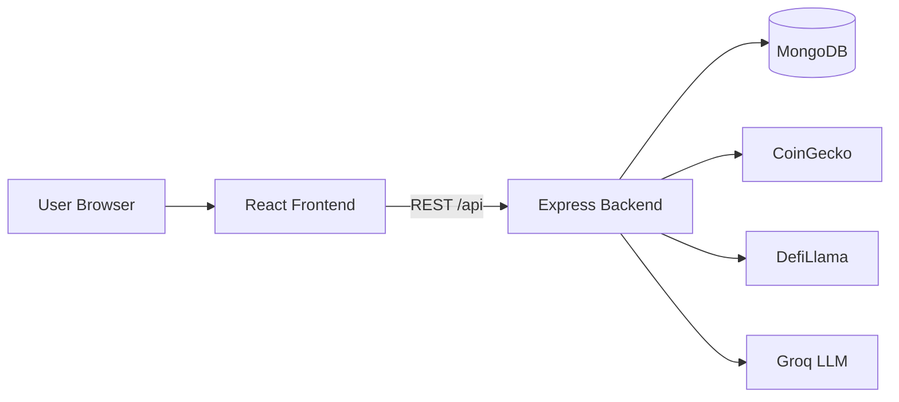
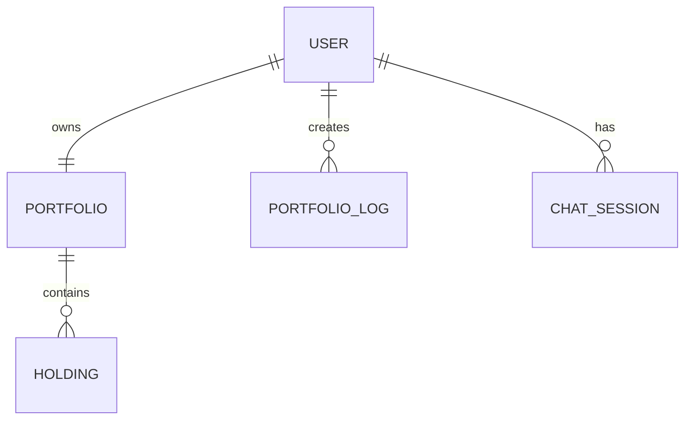

# CryptoSage

**CryptoSage** is a full-stack web application for cryptocurrency and DeFi literacy, portfolio tracking, and journal-based trade logging. It brings together live market data, DeFi protocol metrics, portfolio management, and an educational AI assistant — with explicit safeguards against financial advice.

> **Disclaimer:** CryptoSage is for educational purposes only. It does not provide financial advice. Always do your own research before making investment decisions.

---

## Features

### Portfolio Dashboard
- Track holdings with live market prices
- View portfolio value, allocation, and performance
- Add, update, and remove holdings

### Portfolio Journal
- Log buys, sells, notes, analysis, and risk entries
- Tag entries with sentiment (bullish / bearish / neutral)
- Journal is the source of truth — buy/sell entries can rebuild holdings via chronological replay (average cost basis)
- AI-powered portfolio insights based on your journal and holdings

### Market Explorer
- Browse top cryptocurrencies by market cap
- Search, sort, and paginate coin listings
- View price history charts and sparklines (powered by CoinGecko)

### DeFi Explorer
- Browse DeFi protocols ranked by TVL
- View protocol details and TVL history charts (powered by DefiLlama)

### Trading Calculators
- **PnL** — profit/loss with leverage and fees
- **DCA** — dollar-cost averaging scenarios
- **Risk** — position sizing and risk/reward
- **Take Profit** — target price planning

### AI Assistant (CryptoSage)
- Domain-restricted chat for crypto, DeFi, and app usage questions
- Lightweight RAG knowledge base for educational context
- Topic gate, policy guard, and refusal handling — no investment recommendations or price predictions
- Floating assistant widget available across the app
- Chat sessions persisted in MongoDB

### Authentication & Security
- Email/password registration and login
- JWT-based auth with bcrypt password hashing
- Protected routes on the frontend
- Helmet, CORS, rate limiting, and request ID tracing on the backend
- Interactive API docs via Swagger UI

---

## Tech Stack

| Layer | Technologies |
|-------|-------------|
| **Frontend** | React 18, TypeScript, Vite, React Router, TanStack Query, Tailwind CSS, shadcn/ui, Recharts, Framer Motion |
| **Backend** | Node.js, Express 5, TypeScript, Mongoose, Zod, JWT, bcrypt, Axios, Pino |
| **Database** | MongoDB (Atlas-compatible) |
| **External APIs** | [CoinGecko](https://www.coingecko.com/), [DefiLlama](https://defillama.com/), [Groq](https://groq.com/) (LLM) |

---

## Architecture



### Data Model



### AI Assistant Pipeline

1. **Topic gate** — scores whether the question is crypto/DeFi-related
2. **RAG retrieval** — pulls relevant educational context from a built-in knowledge base
3. **Groq LLM** — generates a structured JSON response
4. **Policy guard** — filters banned advice patterns before returning to the user

---

## Project Structure

```
cryptosage/
├── backend/                 # Express API server
│   └── src/
│       ├── clients/         # CoinGecko, DefiLlama, Groq HTTP clients
│       ├── config/          # Environment, DB, Swagger, logging
│       ├── controllers/     # Route handlers
│       ├── middlewares/     # Auth, validation, rate limiting, errors
│       ├── models/          # Mongoose schemas (User, Portfolio, etc.)
│       ├── repositories/    # Data access layer
│       ├── routes/          # API route definitions
│       ├── services/        # Business logic
│       └── validators/      # Zod request schemas
├── frontend/                # React SPA
│   └── src/
│       ├── components/      # UI components (shadcn/ui, layout, chat)
│       ├── contexts/        # Auth and assistant chat state
│       ├── hooks/           # Data fetching and calculator logic
│       ├── pages/           # Route-level page components
│       └── services/        # API client
└── scripts/                 # Utility scripts (e.g. report generator)
```

---

## Prerequisites

- **Node.js** 18+ and npm
- **MongoDB** instance (local or [MongoDB Atlas](https://www.mongodb.com/atlas))
- **Groq API key** — [console.groq.com](https://console.groq.com/)

---

## Getting Started

### 1. Clone the repository

```bash
git clone https://github.com/<your-username>/cryptosage.git
cd cryptosage
```

### 2. Backend setup

```bash
cd backend
npm install
```

Create `backend/.env`:

```env
NODE_ENV=development
PORT=4000

# MongoDB connection string (Atlas or local)
MONGODB_URI=mongodb+srv://<user>:<password>@<cluster>.mongodb.net/cryptosage

# JWT secret (minimum 16 characters)
JWT_SECRET=your-secure-jwt-secret-here

# Groq API
GROQ_API_KEY=your-groq-api-key
GROQ_BASE_URL=https://api.groq.com/openai/v1
GROQ_MODEL=llama-3.1-8b-instant

# CORS (use * for local dev, or your frontend URL in production)
CORS_ORIGIN=*

# External API timeout in milliseconds
EXTERNAL_API_TIMEOUT_MS=8000
```

Start the API:

```bash
npm run dev
```

The server runs at `http://localhost:4000` by default.

- Health check: `GET http://localhost:4000/api/health`
- API docs: `http://localhost:4000/api-docs`

### 3. Frontend setup

In a new terminal:

```bash
cd frontend
npm install
```

Optional: copy `frontend/.env.example` to `frontend/.env`:

```env
# Set to true only for offline UI demos without a running API
VITE_DEMO_AUTH=false

# Only needed if not using the Vite dev proxy (e.g. production build)
# VITE_API_BASE_URL=http://127.0.0.1:4000/api
```

Start the dev server:

```bash
npm run dev
```

The app runs at `http://localhost:8080`. Vite proxies `/api` to the backend port read from `backend/.env`.

### 4. Use the app

1. Open `http://localhost:8080`
2. Sign up or log in
3. Explore Portfolio, Market, DeFi, Journal, Calculator, and the AI assistant

---

## API Overview

| Endpoint | Description |
|----------|-------------|
| `POST /api/auth/register` | Create an account |
| `POST /api/auth/login` | Log in and receive a JWT |
| `GET /api/auth/me` | Get current user (auth required) |
| `GET /api/portfolio` | Get user portfolio and holdings |
| `POST /api/portfolio/holdings` | Add a holding |
| `GET /api/portfolio/logs` | List journal entries |
| `POST /api/portfolio/logs` | Create a journal entry |
| `GET /api/market/top` | Top coins by market cap |
| `GET /api/market/price/:coinId` | Coin price snapshot |
| `GET /api/market/history/:coinId` | Price history chart data |
| `GET /api/defi/protocols` | List DeFi protocols |
| `GET /api/defi/protocols/:slug` | Protocol details |
| `GET /api/defi/protocols/:slug/tvl` | Protocol TVL history |
| `POST /api/chat` | Ask the AI assistant |
| `POST /api/chat/portfolio-insights` | AI insights on your portfolio (auth required) |
| `GET /api/health` | Service health check |

Full interactive documentation: `http://localhost:4000/api-docs`

---

## Development

### Backend scripts

```bash
cd backend
npm run dev      # Start with hot reload (ts-node-dev)
npm run build    # Compile TypeScript
npm start        # Run compiled output
```

### Frontend scripts

```bash
cd frontend
npm run dev          # Vite dev server
npm run build        # Production build
npm run preview      # Preview production build
npm run lint         # ESLint
npm run test         # Vitest unit tests
```

### Notes

- If port `4000` is in use, set `PORT=4001` in `backend/.env` and restart both backend and frontend.
- MongoDB Atlas requires your IP on the cluster allowlist.
- Market and DeFi routes have stricter rate limits (30 req/min) than the global limit (120 req/min).

---

## Environment Variables Reference

### Backend (`backend/.env`)

| Variable | Required | Default | Description |
|----------|----------|---------|-------------|
| `NODE_ENV` | No | `development` | `development`, `test`, or `production` |
| `PORT` | No | `4000` | API server port |
| `MONGODB_URI` | **Yes** | — | MongoDB connection string |
| `JWT_SECRET` | **Yes** | — | Secret for signing JWTs (min 16 chars) |
| `GROQ_API_KEY` | **Yes** | — | Groq API key for the AI assistant |
| `GROQ_BASE_URL` | No | `https://api.groq.com/openai/v1` | Groq API base URL |
| `GROQ_MODEL` | No | `llama-3.1-8b-instant` | LLM model name |
| `CORS_ORIGIN` | No | `*` | Allowed CORS origin(s) |
| `EXTERNAL_API_TIMEOUT_MS` | No | `8000` | Timeout for CoinGecko/DefiLlama calls |

### Frontend (`frontend/.env`)

| Variable | Required | Default | Description |
|----------|----------|---------|-------------|
| `VITE_DEMO_AUTH` | No | `false` | Use mock auth for offline UI demos |
| `VITE_API_BASE_URL` | No | — | API base URL (only if not using Vite proxy) |

---

## Roadmap

- [ ] Watchlist and price alerts
- [ ] Export journal entries (CSV/PDF)
- [ ] Enhanced RAG with vector embeddings
- [ ] Mobile-responsive improvements
- [ ] Deployment guide (Docker / cloud hosting)

---

## Author

**Priyanshu Chatterjee**

---

## License

ISC
